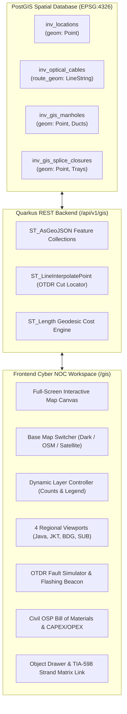
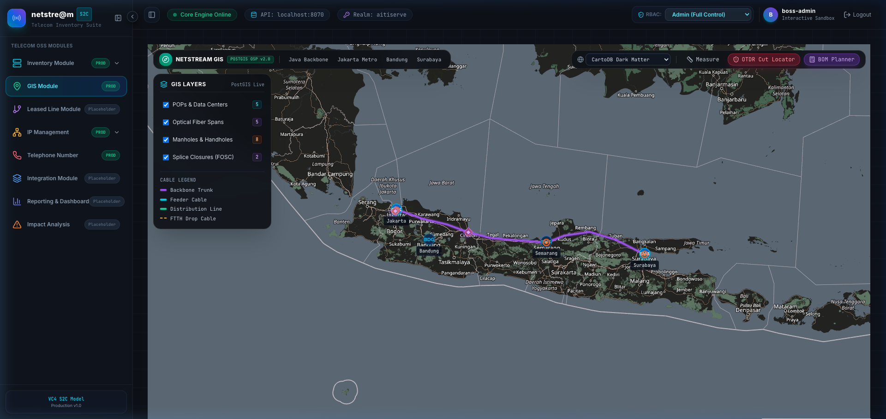
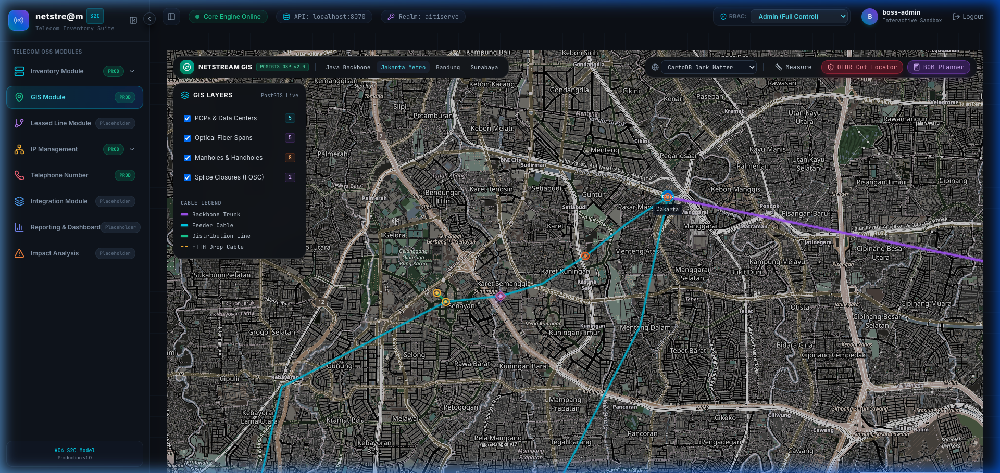
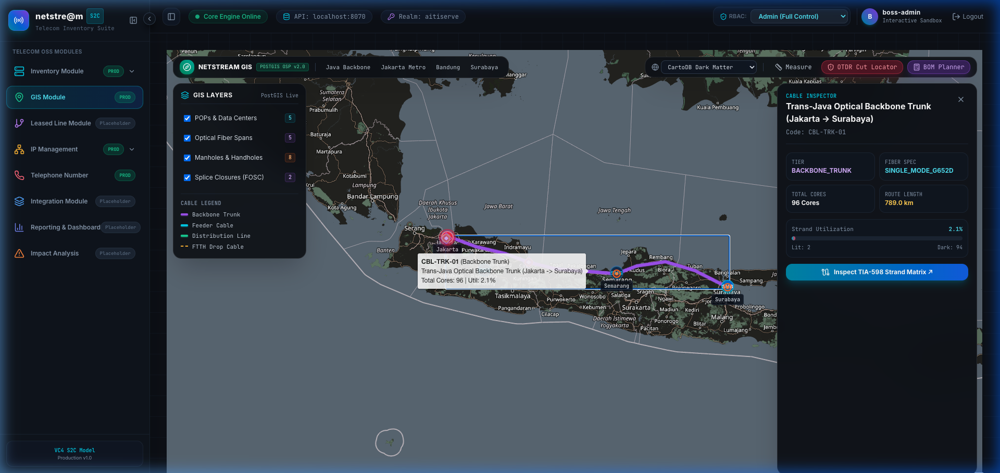
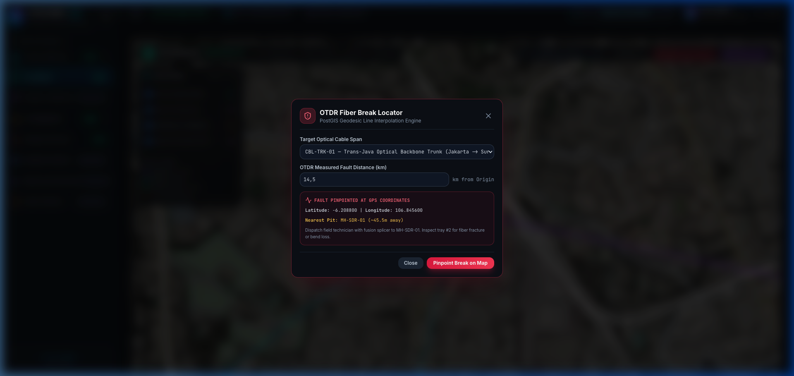
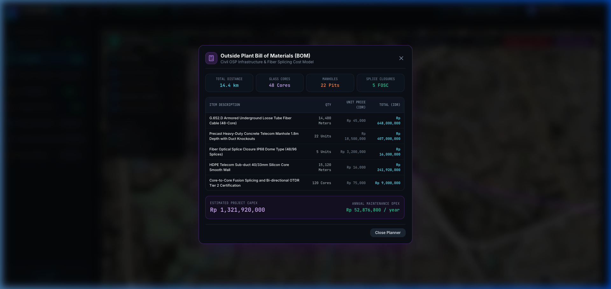

# Netstream Telecom Inventory Suite
## Section 2: GIS Module — PostGIS Native Telecom Spatial Management

---

### Executive Summary

The **GIS Module** delivers an enterprise-grade, interactive geographic information system engineered specifically for telecom network operators and Network Operations Centers (NOC). Built on **PostgreSQL with native PostGIS spatial extensions** and rendered via an optimized **Leaflet mapping canvas**, the module unifies physical outside-plant (OSP) civil infrastructure, optical cable spans, and central office inside-plant (ISP) hardware into a single interactive digital twin.



---

### 1. Key Architectural Capabilities

| Capability | Standard / Technology | Functional Description |
| :--- | :--- | :--- |
| **Native Spatial Geometries** | PostGIS `GEOMETRY(Point, 4326)` & `GEOMETRY(LineString, 4326)` | Accurate geospatial coordinates on the WGS 84 ellipsoid, enabling sub-meter spatial indexing and geodesic measurements. |
| **Non-Linear Cable Paths** | Multi-point `LineString` | Optical cables follow actual civil trenches, ducts, highway rights-of-way, and slack loops rather than simplistic straight lines. |
| **Civil OSP Management** | Precast Manholes, Handholes, Conduits | Tracks physical depth, cover types, and duct entry port capacity (`ductUsed / ductCapacity`). |
| **Optical Splice Closures** | FOSC IP68 Dome Closures | Models joint closures inside maintenance pits, tracking tray capacity and fusion splices. |
| **OTDR Fault Pinpointing** | `ST_LineInterpolatePoint` | Converts optical time-domain reflectometer fault distance (km) to exact latitude/longitude coordinates and identifies the closest manhole for technician dispatch. |
| **Civil OSP BOM Planner** | Geodesic Material Estimator | Calculates required cable reel lengths, precast concrete manholes, FOSC closures, HDPE sub-ducts, and fusion splicing labor. |

---

### 2. Main Map Workspace & Regional Viewports

The workspace provides an unobstructed full-screen mapping canvas featuring four switchable base tile layers:
- **Netstream Dark NOC**: Custom-filtered, high-contrast dark theme without watermarks or third-party API keys.
- **OpenStreetMap**: Standard telecom road grid and municipal boundaries.
- **ESRI World Imagery**: Aerial high-resolution satellite photography for civil trench and pole alignment.
- **CartoDB Positron**: Daytime high-visibility mode for field technicians.

#### Visual Verification: Trans-Java 789 km Optical Backbone
The national view displays the primary trans-island optical trunk (`CBL-TRK-01`) connecting Jakarta Mega POP, Cirebon, Semarang Transit Hub, and Surabaya Metro Gateway:



---

### 3. Outside Plant (OSP) & Metro Street-Level Zoom

Operators can click the **`Jakarta Metro`** viewport to immediately zoom into urban feeder networks along Jl. Rasuna Said, Jl. Gatot Subroto, and the SCBD financial district.

#### Visual Verification: Jakarta Metro Feeder, Distribution & Drop Lines
At street level, the map renders:
- **Feeder Trunk Cables** (Cyan glow polylines along arterial corridors).
- **Distribution Lines** (Emerald green polylines to tenant buildings).
- **FTTH Drops** (Amber dashed polylines into customer demarcations).
- **Maintenance Pits** (Orange circular manholes and amber handholes with depth gauges).
- **Optical Splice Closures** (Purple diamond FOSC icons).



---

### 4. Interactive Object Inspector & TIA-598 Integration

Clicking any cable span or facility on the map opens the **Object Inspector Drawer** on the right side:

#### Features:
1. **Physical Cable Telemetry**:
   - Cable Code, Functional Tier, and Fiber Specification (e.g. `SINGLE_MODE_G652D`).
   - Total Core Count, Lit Cores, Dark Cores, and Utilization % gauge.
   - Geodesic Route Distance calculated directly from PostGIS.
2. **Direct TIA-598 Drilldown**:
   - Clicking **`Inspect TIA-598 Strand Matrix ↗`** launches the full 48/96-core color strand modal without navigating away from the GIS canvas.

#### Visual Verification: Cable Inspector Drawer


---

### 5. OTDR Fiber Break Locator Simulator

When an optical cable suffers physical damage (e.g., from backhoe excavation, traffic collision, or landslide), an Optical Time-Domain Reflectometer (OTDR) measures the optical distance to the break in kilometers.

The **OTDR Break Locator** translates this linear optical distance into an exact geographical point along the PostGIS `LineString`:

```sql
-- PostGIS Line Interpolation Formula
SELECT 
    ST_Y(ST_LineInterpolatePoint(c.route_geom, LEAST(1.0, GREATEST(0.0, (:distKm * 1000.0) / ST_Length(c.route_geom::geography))))) as fault_lat,
    ST_X(ST_LineInterpolatePoint(c.route_geom, LEAST(1.0, GREATEST(0.0, (:distKm * 1000.0) / ST_Length(c.route_geom::geography))))) as fault_lon
FROM inventory.inv_optical_cables c
WHERE c.id = :cableId;
```

#### Incident Dispatch Workflow:
1. Operator inputs the cable code and fault distance (e.g. `14.5 km`).
2. The system calculates the exact GPS coordinate (`-6.208800, 106.845600`).
3. An animated **pulsing red alarm beacon** and a **150-meter buffer impact zone** are rendered on the map.
4. The system executes a nearest-neighbor spatial search (`<->`) to identify the closest roadside manhole (`MH-SDR-01`, ~45m away) and outputs repair instructions.

#### Visual Verification: OTDR Break Locator Modal & Alarm Beacon


---

### 6. Outside Plant Bill of Materials (BOM) & Cost Engine

The **BOM Planner** allows network planning engineers to select cable spans and automatically generate a complete Outside Plant Bill of Materials with estimated CAPEX and annual maintenance OPEX:

#### Included Material Estimations:
1. **G.652.D Armored Optical Cable**: Reel length with 5% slack loop allowance.
2. **Precast Concrete Telecom Manholes**: 1.8m depth units with knockouts.
3. **FOSC IP68 Splice Closures**: Dome enclosures with splice trays.
4. **HDPE Silicon Sub-ducts**: 40/33mm smooth-wall conduits.
5. **Core-to-Core Fusion Splicing & Tier-2 OTDR Certification Labor**.

#### Visual Verification: Outside Plant BOM Table


---

### 7. REST API Specifications

The GIS subsystem exposes dedicated endpoints documented in OpenAPI:

| Method | Endpoint | Description | Request / Response |
| :--- | :--- | :--- | :--- |
| `GET` | `/api/v1/gis/layers` | Returns full network layers as GeoJSON FeatureCollections (`locations`, `cables`, `manholes`, `spliceClosures`) with summary statistics. | Output: `NetworkLayersResponse` |
| `POST` | `/api/v1/gis/otdr-locate` | Calculates the exact GPS coordinate of an optical break given cable ID and distance in km. | Input: `OtdrLocateRequest`<br/>Output: `OtdrLocateResponse` |
| `POST` | `/api/v1/gis/bom` | Calculates Outside Plant materials, quantities, unit prices, and CAPEX/OPEX for selected spans. | Input: `BomRequest`<br/>Output: `BillOfMaterialsResponse` |
| `POST` | `/api/v1/gis/manholes` | Provisions a new Outside Plant manhole, handhole, or pole with spatial Point geometry. | Input: `CreateManholeRequest`<br/>Output: `ManholeResponse` |

---

### 8. SOP-GIS: Standard Operating Procedures

#### SOP-GIS-01: Navigating and Inspecting Cable Infrastructure
1. Open the sidebar and click **`GIS Module`** (`/gis`).
2. Use the top viewport presets (**`Java Backbone`**, **`Jakarta Metro`**, **`Bandung`**, or **`Surabaya`**) to focus on the area of interest.
3. Use the left **GIS Layers** panel to toggle visibility of central POPs, cables, manholes, or splice closures.
4. Click on any cable polyline to inspect its fiber capacity, lit/dark count, and utilization percentage in the right drawer.
5. Click **`Inspect TIA-598 Strand Matrix ↗`** to review individual core strand status.

#### SOP-GIS-02: Geodesic Route Distance Measurement
1. Click the **`Measure`** button in the top toolbar.
2. Click points on the map along the desired conduit or trench path.
3. The ruler draws a cyan dashed measurement line and displays the real-time geodesic distance in kilometers.
4. Click **`Measuring (X.XX km)`** to clear the measurement pins.

#### SOP-GIS-03: Simulating and Locating an Optical Fiber Break
1. In the top toolbar, click **`OTDR Cut Locator`**.
2. Select the target optical cable from the dropdown menu.
3. Input the optical distance in kilometers reported by the OTDR test set.
4. Click **`Pinpoint Break on Map`**.
5. The map automatically centers on the fault location, drops a pulsing red alarm beacon with an impact buffer ring, and displays the nearest roadside maintenance pit for field crew dispatch.
