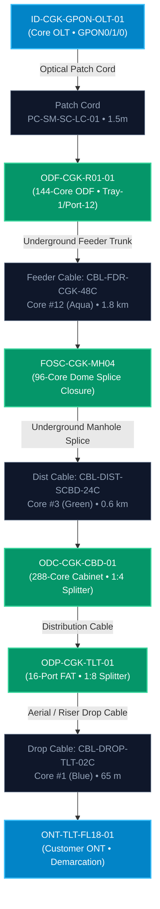

# End-to-End GPON FTTH & Passive Optical Infrastructure (ODN) Use Case

## Document Control
- **Document Title**: Technical Architecture & Operating Procedure: End-to-End GPON FTTH & Passive Optical Distribution Network (ODN)
- **Classification**: Confidential & Proprietary — Netstream Telecom Inventory Suite
- **Author**: Antigravity Network Architecture Team
- **Version**: 2.0.0
- **Status**: Production Approved

---

## 1. Executive Summary & Polymorphic Modeling Strategy (Option C)

Telecom networks contain two fundamentally distinct classes of physical equipment:
1. **Active Network Equipment (ANE)**: Electronic devices powered by AC/DC electricity, configured with IP management addresses, running firmware/NOS (e.g., Cisco IOS-XR, Huawei VRP), and reporting SNMP/Telemetry (Routers, Switches, DWDM Transponders, GPON OLTs).
2. **Passive Network Equipment (PNE) / Infrastructure**: Non-powered physical optical components that guide, split, cross-connect, or protect optical light without electronic processing (ODF, ODC, ODP, Splice Closures, PLC Splitters).

Netstream implements **Option C: Hybrid Polymorphic Model**:
- Passive devices share baseline physical asset and location tracking (geographical site, floor/manhole/street zone, serial number, cost/CAPEX, total fiber strand/core capacity).
- Specialized passive fields are supported dynamically (Splice Trays, 1:4 / 1:8 / 1:16 PLC Splitter Ratios, SC/APC & LC/UPC Optical Connectors, Non-Powered pass-through status).
- End-to-end service paths trace **both Active and Passive equipment**, tracking optical cables, core strand numbers, tube colors (TIA-598), and insertion losses across the entire physical fiber plant.

---

## 2. Passive Optical Infrastructure Hierarchy

---

## 3. End-to-End Circuit Flow Scenario: `SVC-GPON-2026-0888`

### Service Metadata
- **Service Identifier**: `SVC-GPON-2026-0888`
- **Customer**: `PT Telkom Landmark Tower (Enterprise FTTO / Gigabit Broadband)`
- **Service Classification**: `GPON_BROADBAND` (1000 Mbps Committed / 2.5 Gbps Downstream GPON)
- **SLA Tier**: `GOLD (99.95% Availability)`
- **Monthly Recurring Revenue (MRC)**: `$2,450.00 / month`
- **A-End Origin**: Jakarta Core Central Office (Room 301, Rack A04)
- **Z-End Demarcation**: Telkom Landmark Tower Fl. 18 (Suite 1802)

---

### Step-by-Step 6-Hop Physical & Optical Mapping

| Hop # | Device Hostname | Equipment Classification | Role & Location | Interface / Port | Interconnect Conduit & Optical Core Specs |
| :---: | :--- | :--- | :--- | :--- | :--- |
| **1** | `ID-CGK-GPON-OLT-01` | **Active** (GPON OLT) | Central Office Headend Chassis | `GPON0/1/0` (2.5 Gbps / 1.25 Gbps) | **Patch Cord**: `PC-SM-SC-LC-01` (1.5m Single-Mode Yellow Duplex) |
| **2** | `ODF-CGK-R01-01` | **Passive** (144-Core ODF) | Central Office Rack A04 (4U Chassis) | `Tray-1/Port-12` (SC/APC) | **Feeder Trunk**: `CBL-FDR-CGK-48C` • **Core #12 (Aqua Tube / Aqua Core)** (1.8 km G.652D) |
| **3** | `FOSC-CGK-MH04` | **Passive** (96-Core FOSC) | Underground Gatot Subroto Manhole #4 | `Splice-Tray-1/Core-12` (Fusion Splice) | **Underground Splice Joint**: 0.02 dB Splice Loss • Feeder-to-Dist Joint (0.9 km) |
| **4** | `ODC-CGK-CBD-01` | **Passive** (288-Core Cabinet) | SCBD Zone Outdoor Street Cabinet | `Splitter-1:4/Out-2` (1:4 PLC Splitter) | **Distribution Cable**: `CBL-DIST-SCBD-24C` • **Core #3 (Green Tube / Green Core)** (0.6 km) |
| **5** | `ODP-CGK-TLT-01` | **Passive** (16-Port FAT) | Telkom Landmark Tower Riser Shaft | `Drop-Port-4` (1:8 PLC Splitter) | **Customer Drop**: `CBL-DROP-TLT-02C` • **Core #1 (Blue Core)** (65 m G.657A2 Bending-Insensitive) |
| **6** | `ONT-TLT-FL18-01` | **Active / CPE** (Gigabit ONT) | Customer Demarcation (Suite 1802) | `GE-LAN1` (1000BASE-T RJ45) | **Customer LAN**: 1 Gbps Symmetrical Fiber Internet Demarcation Hand-off |

---

## 4. Optical Power Budget & Link Verification Calculation

- **OLT Transmit Power (Class B+)**: `+3.0 dBm` (1490 nm Downstream)
- **ODF Connector & Patch Cord Insertion Loss**: `-0.35 dB`
- **Feeder Cable Fiber Attenuation (1.8 km @ 0.35 dB/km)**: `-0.63 dB`
- **FOSC Fusion Splice Loss (2 splices @ 0.02 dB)**: `-0.04 dB`
- **ODC 1:4 First-Stage PLC Splitter Insertion Loss**: `-7.25 dB`
- **Distribution Cable Fiber Attenuation (0.6 km @ 0.35 dB/km)**: `-0.21 dB`
- **ODP 1:8 Second-Stage PLC Splitter Insertion Loss**: `-10.50 dB`
- **Drop Cable Fiber Attenuation (65m @ 0.40 dB/km)**: `-0.03 dB`
- **Optical Adapters & Mechanical Connectors (4 mated pairs @ 0.25 dB)**: `-1.00 dB`
- **Total End-to-End Optical Loss (Total Split Ratio 1:32)**: **`-20.01 dB`**
- **Calculated Rx Power at Customer ONT**: `+3.0 dBm - 20.01 dB = -17.01 dBm`
- **ONT Receiver Dynamic Range**: `-8.0 dBm to -27.0 dBm`
- **Safety Margin**: **`+9.99 dB (PASS — Optimal Optical Margin)`**

---

## 5. TIA-598 Optical Fiber Color Standard Reference

When recording optical cable strands in Netstream, engineers must adhere to the standard 12-color code sequence:

| Fiber # | Color Name | Hex Code | Visual Badge | Usage in Netstream GPON Flow |
| :---: | :--- | :---: | :---: | :--- |
| **1** | Blue | `#3b82f6` | 🔵 Blue | Used in Drop Cable `CBL-DROP-TLT-02C • Core #1` |
| **2** | Orange | `#f97316` | 🟠 Orange | Spare Drop Core |
| **3** | Green | `#22c55e` | 🟢 Green | Used in Distribution `CBL-DIST-SCBD-24C • Core #3` |
| **4** | Brown | `#92400e` | 🟤 Brown | Distribution Spare |
| **5** | Slate / Gray | `#64748b` | ⚪ Slate | Feeder Trunk Secondary |
| **6** | White | `#f8fafc` | ⚪ White | Distribution Spare |
| **7** | Red | `#ef4444` | 🔴 Red | High-Priority Enterprise Ring |
| **8** | Black | `#1e293b` | ⚫ Black | Metro Dark Fiber |
| **9** | Yellow | `#eab308` | 🟡 Yellow | Patch Cord Interconnect |
| **10** | Violet / Purple | `#a855f7` | 🟣 Violet | DWDM Lambda Uplink |
| **11** | Rose / Pink | `#ec4899` | 🌸 Rose | Dedicated Protection Core |
| **12** | Aqua / Cyan | `#06b6d4` | 🔷 Aqua | Used in Feeder Trunk `CBL-FDR-CGK-48C • Core #12` |

---

## 6. How to View & Provision in Netstream Application

1. **Viewing Passive Devices**:
   - Open **Physical Inventory (42U)**.
   - Click the **`[🍃 Passive Optical Infrastructure (PNE)]`** tab to filter out active routers and view all ODFs, ODCs, ODPs, and Splice Closures.
   - Review total strand capacities (e.g. `144 Cores`, `288 Cores`) and non-powered status.
2. **Registering a New Passive Device**:
   - Click **`Add Equipment`**.
   - Select the **`🍃 Passive Optical Infrastructure (PNE)`** toggle.
   - Fill in Equipment Code (e.g. `ODC-CGK-CBD-02`), form factor, and total port/core capacity. Notice the system automatically disables IP address requirements.
   - Click **`Register Passive Infrastructure`**.
3. **Viewing the 6-Hop GPON Flow**:
   - Open **Service Inventory**.
   - Click on **`SVC-GPON-2026-0888`** (`PT Telkom Landmark Tower`).
   - The interactive **Graphical Schematic** will render the complete 6-hop path from OLT -> ODF -> FOSC -> ODC -> ODP -> ONT, showing traveling optical laser pulses, cable codes, and core colors.
