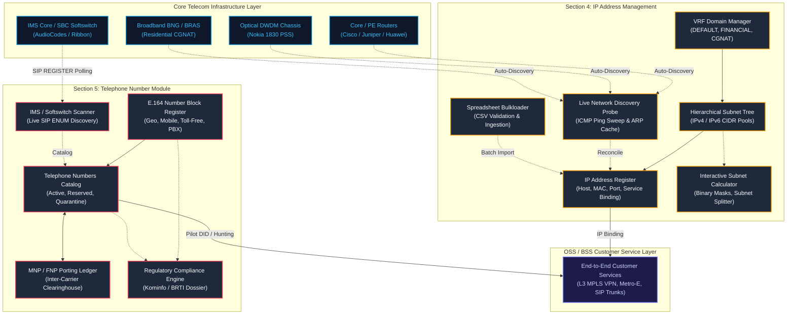
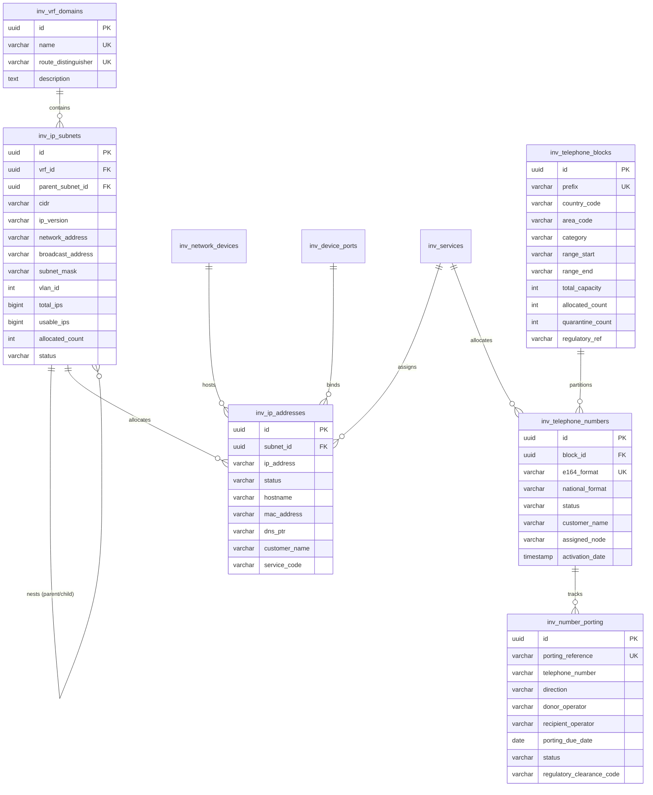

# Technical Architecture & Operations Manual: IP Address Management (IPAM) & Telephone Number Management (TNM)

## Document Control
- **Document Title**: Technical Architecture, Data Models & Operating Procedures: IP Management & Telephone Number Modules
- **Document Code**: NETSTREAM-DOC-MOD-04-05
- **Classification**: Telecom OSS/BSS Standards & Operational Guide — Netstream S2C Platform
- **Aligned Specifications**: Proposal Document Sections 4 & 5 (VC4 S2C Standards)
- **Author**: Antigravity Telecom & IT Architecture Engineering
- **Standards Compliance**: RFC 791 (IPv4), RFC 8200 (IPv6), RFC 4632 (CIDR), RFC 6598 (CGNAT), ITU-T E.164, 3GPP TS 23.003, PM Kominfo No. 14/2018 (National Numbering Plan), BRTI MNP/FNP Directives
- **Version**: 1.0.0
- **Status**: Production Approved

---

## 1. Executive Summary

In modern converged telecommunications networks, digital resources — specifically **IP Addresses (IPv4/IPv6)** and **Telephone Numbers (E.164)** — constitute the critical logical identifiers that bind physical transport hardware, virtual network functions (VNF), and customer enterprise services into an operable telco ecosystem.

The **Netstream S2C Platform** delivers carrier-grade inventory management across both domains:
1. **IP Address Management (IPAM) Module (Section 4)**: Centralizes multi-VRF IPv4/IPv6 subnetting, automatic boundary calculations, interface/port bindings, bulkloader ingestion, and live ICMP/ARP auto-discovery.
2. **Telephone Number Module (TNM) (Section 5)**: Manages national geographic area codes, mobile MSISDNs, toll-free 0800, premium rate lines, and private PBX extensions; coordinates Mobile and Fixed Number Portability (MNP/FNP); interrogates live IMS/SBC softswitches; and enforces Kominfo/BRTI regulatory quotas.



---

## 2. Section 4: IP Management Module (IPAM) Architecture

### 2.1 Multi-VRF Routing Domains & Subnet Hierarchy
Telecommunications operators maintain physically shared yet logically isolated routing tables (Virtual Routing and Forwarding - VRF). The IPAM module prevents address collisions by scoping all subnets within designated VRF domains:

| VRF Domain Name | Route Distinguisher (RD) | Target Application & Scope |
| :--- | :--- | :--- |
| `DEFAULT` | `65000:0` | Global backbone infrastructure, core router loopbacks, and inter-POP transport. |
| `VRF_FINANCIAL_CORE` | `65000:100` | Ultra-low latency MPLS VPN for commercial banking (e.g. Bank Central Asia, Bank Mandiri). |
| `VRF_LTE_EPC` | `65000:200` | 4G/5G mobile packet core, eNodeB/gNodeB S1-U user plane transport. |
| `VRF_CGNAT_RESIDENTIAL` | `65000:300` | RFC 6598 Shared Address Space (`100.64.0.0/10`) for residential FTTH GPON subscriber sessions. |
| `VRF_DWDM_MGMT` | `65000:400` | Out-of-band supervisory optical transponder channels (OSC) and NMS telemetry. |

#### Subnet Partitioning Model
Subnets support multi-tier nesting:
- **Parent Allocations**: Supernet blocks (e.g., `10.240.0.0/16` or `100.64.0.0/18`).
- **Child Subnets**: Regional or node-specific blocks (e.g., `10.240.10.0/24` for Jakarta Central POP Loopbacks).
- **Subnet Partitions**: Point-to-Point `/30` links or individual `/32` loopback host assignments.

### 2.2 Individual IP Address Lifecycle & Asset Mapping
Every tracked IP address is maintained in an authoritative register containing:
- **Protocol**: IPv4 (32-bit dotted-decimal) or IPv6 (128-bit hexadecimal).
- **Classification Status**:
  - `ALLOCATED`: Active assignment bound to hardware or service.
  - `RESERVED`: Held for future planned expansion or VIP projects.
  - `AVAILABLE`: Unassigned capacity inside the subnet boundary.
  - `GATEWAY`: First-hop default gateway address (HSRP/VRRP/Anycast).
  - `DHCP_POOL`: Dynamic lease pool for broadband subscriber sessions.
  - `QUARANTINE`: Temporarily isolated due to ARP conflict, IP collision, or security anomaly.
- **Hardware Binding**: Physical Chassis Hostname (e.g., `ID-CGK-PE-RTR-01`), Interface (`HundredGigE0/0/0/1`), Layer-2 MAC address, and DNS PTR reverse record.
- **Commercial Binding**: Customer Organization Name, Billing Account, and Service Code (e.g., `SVC-VPN-2026-0001`).

### 2.3 Interactive Telco Subnet Calculator Engine
The built-in subnet calculator executes real-time bitwise operations:
- **Address Boundary Resolution**:
  $$\text{Network Address} = \text{IP} \ \& \ \text{Subnet Mask}$$
  $$\text{Broadcast Address} = \text{Network Address} \ | \ (\sim \text{Subnet Mask})$$
- **Capacity Calculations**:
  $$\text{Total Addresses} = 2^{(32 - \text{Prefix})}$$
  $$\text{Usable Hosts} = \max(0, 2^{(32 - \text{Prefix})} - 2) \quad (\text{for } \text{Prefix} \le 30)$$
- **Binary Bit Alignment Visualizer**: Deconstructs each octet into 8 binary bits with a visual representation of contiguous network ones versus host zeroes.
- **Hierarchical Subnet Splitter**: Shows direct partitioning into smaller prefix tiers (e.g., dividing a `/24` into two `/25`s, four `/26`s, or eight `/27`s).

### 2.4 Live Network Auto-Discovery Probe
The discovery engine interrogates live network segments to maintain synchronization between physical reality and OSS documentation:
1. **Scanning Vectors**: Simulates ICMP Echo sweeps, ARP broadcast cache lookups, and SNMP `sysDescr.0` (OID `.1.3.6.1.2.1.1.1.0`) queries.
2. **Telemetry Capture**: Measures round-trip latency (ms), extracts hardware MAC addresses, resolves Vendor OUI (e.g., Cisco, Nokia, Juniper, Huawei), and identifies open management ports (22 SSH, 80 HTTP, 161 SNMP, 179 BGP).
3. **Reconciliation States**:
   - `MATCHED`: Live host matches existing IPAM record.
   - `ACTIVE_UNREGISTERED`: Active device detected on network without documentation.
   - `CONFLICT`: MAC address or hostname discrepancy detected.
4. **One-Click Reconcile**: Ingests unregistered hosts directly into the IPAM catalog.

### 2.5 Bulkloader Spreadsheet Engine
Facilitates bulk migration and batch provisioning:
- **Format**: Standardized CSV input with header:
  `IP Address, VRF, Status, Hostname, Interface, MAC Address, Customer Name, Service Code, Notes`
- **Validation Pipeline**: Checks syntax validity, verifies subnet membership, and executes intra-VRF collision checks before committing.
- **Audit Logging**: Generates detailed error logs for unmapped rows or collision conflicts.

---

## 3. Section 5: Telephone Number Module (TNM) Architecture

### 3.1 National Numbering Plan & E.164 Block Management
The Telephone Number Module adheres to ITU-T Recommendation E.164 and Indonesian National Numbering Regulations (Permen Kominfo No. 14/2018):

```
+62 (Country Code) - Area Code (1-3 Digits) - Subscriber Number (6-8 Digits)
```

#### Supported Number Categories:
1. **Geographic (PSTN Fixed Lines)**:
   - Area Code `021` (Jabodetabek): `+62 21 5000 xxxx` (Sudirman/Kuningan Financial Core)
   - Area Code `022` (Bandung Raya): `+62 22 4200 xxxx`
   - Area Code `031` (Surabaya): `+62 31 8200 xxxx`
2. **Mobile MSISDN (Cellular 4G/5G)**:
   - Tier-1 National Mobile Blocks: `+62 811 900 xxxx` (VoLTE/VoNR Enabled)
3. **Toll-Free (Freephone 0800)**:
   - Reverse charge corporate hotlines: `0800-1-800-xxx` (Terminated at Intelligent Network SCP)
4. **Premium Rate (0809)**:
   - Value-added interactive services: `+62 21 809 1xxx`
5. **Call Center Short Codes (1500xxx)**:
   - Nationwide single-access business numbers.
6. **Enterprise PBX Extensions**:
   - Private 4-digit internal extensions: `EXT 4000 - 4999` (Bound to Cisco CUCM or Asterisk SIP trunks).

### 3.2 Individual Number Directory & Infrastructure Mapping
Individual telephone numbers are linked to physical and logical inventory assets:
- **Customer Association**: Corporate subscriber name, billing account number.
- **Service Association**: VoIP SIP Trunk circuit code (e.g., `SVC-VOIP-SIP-001`).
- **Core Node Association**: Host Session Border Controller (SBC) or IP Multimedia Subsystem (IMS) node (e.g., `ID-CGK-IMS-SBC-01`).
- **Site Demarcation**: Physical installation address (e.g., SCBD Financial Center Floor 18).
- **Quarantine Aging Policy**: When a subscriber terminates service, the number transitions to `QUARANTINE` for a mandatory 60-day aging period before returning to `AVAILABLE`, preventing erroneous incoming calls to new subscribers.

### 3.3 Mobile & Fixed Number Portability (MNP / FNP) Central Registry
Number portability allows subscribers to retain their numbers when changing operators:
- **Porting Directions**:
  - `PORTED_IN`: Inward porting from donor telco (e.g., Telkomsel, Indosat Ooredoo) into Netstream.
  - `PORTED_OUT`: Outward migration from Netstream to another licensed operator.
- **Routing Numbers (LRN / RN)**: Generates routing prefixes (e.g., `RN021001` or `RN0815001`) utilized by core softswitches to route calls via national transit clearinghouses.
- **Clearinghouse Workflow**: Tracks Regulatory Clearance Codes issued by BRTI / Kominfo with status auditing (`PENDING_APPROVAL`, `APPROVED`, `COMPLETED`, `REJECTED`).

### 3.4 Softswitch & IMS Live Auto-Discovery
Interrogates core voice platforms to detect live signaling endpoints:
- **Signaling Vectors**: Inspects SIP `REGISTER`, `OPTIONS`, and ENUM database entries across AudioCodes, Ribbon, and Cisco SBC clusters.
- **Attribute Matching**: Resolves client User-Agent headers (e.g., `Cisco-CP8865`, `Audiocodes-Mediant`, `Grandstream-GXP2170`), registration timestamps, and active signaling IP addresses.
- **Rogue Line Detection**: Flags unauthorized active SIP registrations (`ROGUE_UNMAPPED`) that lack corresponding service records in the OSS inventory.

### 3.5 Regulatory Compliance & Reporting (Kominfo / BRTI)
Enforces statutory compliance for licensed telecommunications operators:
- **Capacity Utilization Audits**: Calculates active line saturation against licensed block quotas.
- **Quarantine Monitoring**: Tracks aging velocity to satisfy consumer protection mandates.
- **Dossier Export**: Generates machine-readable JSON dossiers for regulatory reporting to Kominfo.

---

## 4. Database Schema Reference

The modules are backed by relational tables defined in [ipam_and_telephony_schema.sql](file:///Users/chaerry/Development/antigravity/Netstream/backend/src/main/resources/db/ipam_and_telephony_schema.sql):



---

## 5. Standard Operating Procedures (SOP)

### SOP-IPAM-01: Registering a New Subnet Block
1. Navigate to **IP Management** (`/ipam`) via the sidebar.
2. Select **New Subnet Block** in the top header.
3. Select the target **IP Protocol Version** (`IPv4` or `IPv6`) and **VRF Domain** (`DEFAULT`, `VRF_FINANCIAL_CORE`, etc.).
4. Enter the CIDR notation (e.g. `10.240.30.0/24`), Subnet Name, Gateway IP, and 802.1Q VLAN Tag.
5. Click **Register Subnet**. The system will calculate network boundaries and update capacity metrics.

### SOP-IPAM-02: Performing Live Network Auto-Discovery
1. Select the **Live Network Discovery** tab on `/ipam`.
2. Select the target CIDR from the dropdown (e.g. `10.240.10.0/24`).
3. Click **Start Discovery Scan**.
4. Review the discovered hosts table:
   - Hosts marked `Registered Match` are already cataloged.
   - Hosts marked `Unregistered In Live Network` represent active devices discovered via ping sweep.
5. Click **Import to IPAM** on any unregistered host to automatically provision the record into the inventory.

### SOP-IPAM-03: Bulk Importing IP Allocations
1. Select the **Bulkloader Spreadsheet** tab on `/ipam`.
2. Click **Download CSV Template** to review the expected schema.
3. Paste CSV records into the text editor.
4. Click **Validate & Preview Rows** to verify formatting and collision-free status.
5. Click **Commit IP Allocations** to commit records into the database.

### SOP-TNM-01: Provisioning a Telephone Number
1. Navigate to **Telephone Number** (`/telephony`) via the sidebar.
2. Click **Allocate Number**.
3. Select the parent Number Block (e.g., `+62 21 5000 xxxx`).
4. Enter the E.164 number (`+622150003001`) and subscriber details.
5. Link the customer name, voice service code (`SVC-VOIP-SIP-002`), and SBC node (`ID-CGK-IMS-SBC-01`).
6. Click **Commit Allocation**.

### SOP-TNM-02: Processing an Inward Number Port (MNP/FNP)
1. Select the **MNP / FNP Number Porting** tab on `/telephony`.
2. Click **New Porting Order**.
3. Select **Port-In**, enter the phone number, Donor Operator, and Cutover Date.
4. Provide the subscriber authorization verification notes.
5. Click **Submit Porting Order**. The record will be assigned a tracking reference and cleared via regulatory protocols.

### SOP-TNM-03: Exporting Regulatory Compliance Dossiers
1. Select the **Regulatory & Compliance (Kominfo)** tab on `/telephony`.
2. Review the four capacity indicators (Total Capacity, Active Lines, Quarantine Pool, Ported Numbers).
3. Verify that all licensed blocks show `Valid License` status.
4. Click **Export Regulatory Audit Dossier (JSON)** to download the compliance package for official regulatory submission.
