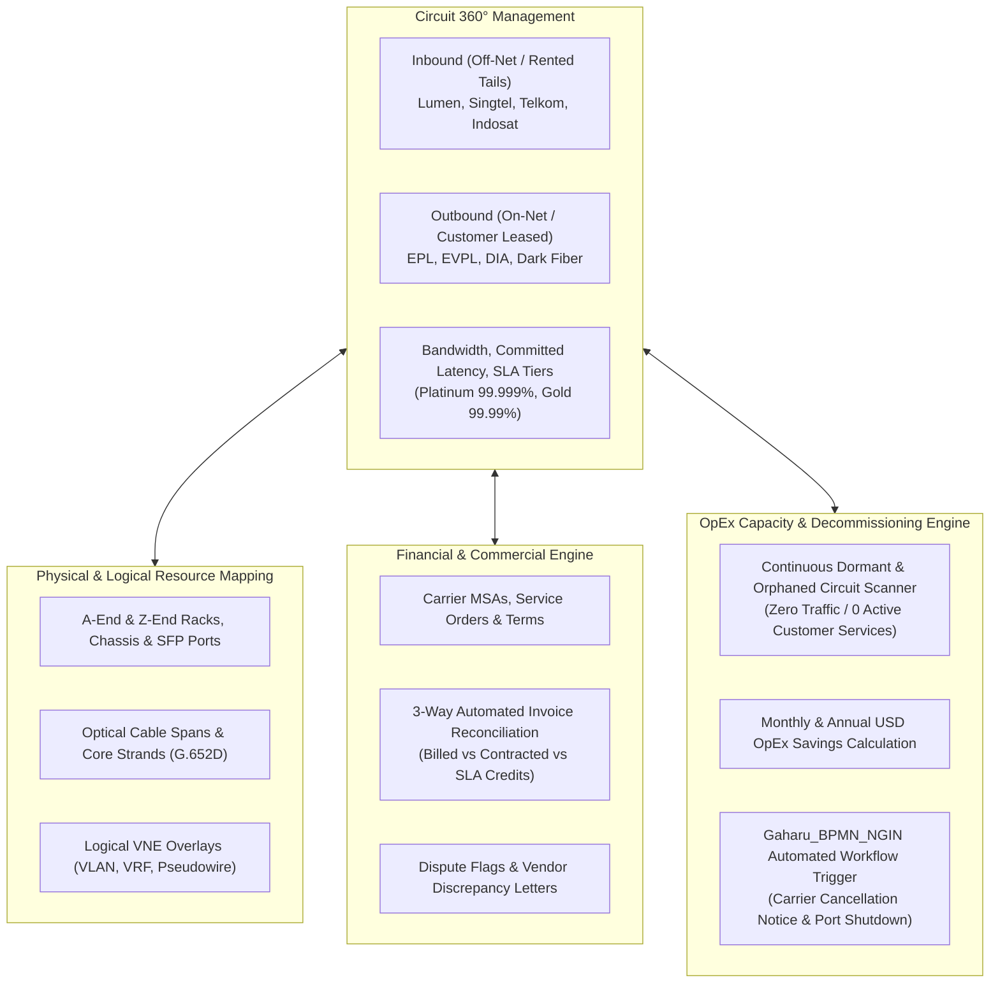
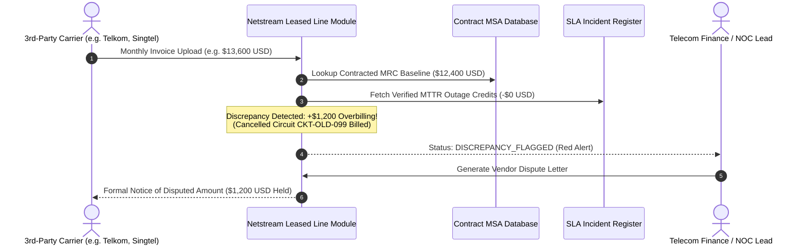

# Netstream Telecom Inventory Suite
## Section 3: Leased Line Module — Enterprise Circuit Lifecycle & OpEx Cost Engine (VC4 S2C Model)

---

### Executive Summary

The **Leased Line Module** delivers an enterprise-grade telecom circuit management, commercial register, automated vendor invoice audit, and OpEx capacity reduction system adhering to the **VC4 S2C Model** standards. Designed for Tier-1 and Tier-2 telecom operators, service providers, and large enterprise networks, the module manages dedicated point-to-point and multipoint circuits across both **Inbound (Off-Net / 3rd-Party Leased Capacity)** and **Outbound (On-Net / Retail & Wholesale Enterprise Circuits)** dimensions with default currency standard in **USD ($)**.



---

### 1. Key Architectural Capabilities

| Capability | Standard / Standardized Formula | Telecom & IT Implementation |
| :--- | :--- | :--- |
| **Circuit Direction Segregation** | Inbound (Off-Net) vs Outbound (On-Net) | Distinguishes whether circuit is an OpEx cost rented from 3rd-party carriers (Telkom, Lumen, Singtel) or Revenue generated from retail enterprise clients (BCA, Mandiri). |
| **Multi-Technology Coverage** | EPL, EVPL, DIA, Dark Fiber, DWDM Lambda, SDH/VC4 | Supports full spectrum of dedicated telecom transmission services from unlit dark fiber pairs to 100G coherent DWDM lambdas. |
| **End-to-End Hop Visualizer** | Physical-to-Logical Traceability | Reconstructs the end-to-end circuit route: Origin Location ➔ SFP Hand-off Port ➔ Fiber Cable & Strand ➔ VNE / VLAN Tag ➔ Destination SFP Port ➔ Destination Facility. |
| **Automated 3-Way Invoice Audit** | `NetPayable = BilledMRC - SLAPenaltyCredits` | Automatically compares vendor monthly billed MRC against signed contract rates, highlighting rate mismatches and billing for cancelled circuits. |
| **OpEx Reduction Engine** | Dormant & Orphaned Line Detection | Scans all inbound leased lines where utilization &lt; 1% or zero active customer services exist for &gt;60 days, calculating monthly USD savings. |
| **Gaharu BPMN NGIN Bridge** | Process Definition: `leased_line_cancellation_flow` | 1-Click trigger dispatching an asynchronous workflow instance in `Gaharu_BPMN_NGIN` to manage legal notice, physical port shutdown, and final billing cessation. |
| **SLA Outage & Rebate Engine** | MTTR Penalty Rebates | Calculates contractual credits owed by carriers when downtime exceeds MTTR guarantees (e.g. 2h or 4h targets). |

---

### 2. Supported Leased Line Technologies

1. **Ethernet Private Line (EPL)**:
   - Dedicated, point-to-point Layer-2 Ethernet service over dedicated physical network ports.
   - Transparent frame transmission (VLAN tags, jumbo frames, BPDUs).
2. **Ethernet Virtual Private Line (EVPL)**:
   - Symmetrical Layer-2 point-to-point service using 802.1Q / QinQ VLAN multiplexing over shared physical UNIs.
3. **Dedicated Internet Access (DIA)**:
   - Symmetrical, unshared business broadband directly terminating on enterprise edge routers with dedicated /28 or /29 public IPv4 blocks.
4. **Dark Fiber Lease (Unlit Core Pair)**:
   - Long-term or monthly rental of unlit G.652D optical fibers lit directly by the operator's coherent 100G/400G transponders.
5. **DWDM Lambda / Optical Wavelength**:
   - Dedicated 10G/100G optical wavelength channel over trans-national or submarine DWDM systems (e.g. Singapore-Jakarta Equinix landing).
6. **SDH / Sonet VC4 Circuits**:
   - Legacy high-reliability TDM circuits (STM-1, STM-4, STM-16, VC4) for banking and critical infrastructure telemetry.

---

### 3. Automated 3-Way Invoice Reconciliation Workflow



---

### 4. OpEx Saver & Gaharu BPMN Ngin Integration

Unused leased lines represent one of the largest sources of avoidable OpEx for telecom carriers. When an enterprise customer terminates or moves a branch office, the carrier often forgets to cancel the underlying 3rd-party off-net tail leased from local incumbents.

The **Capacity Audit Engine**:
1. Continuously correlates each leased line against the active `inv_services` table.
2. If zero active services are mapped and utilization is &lt; 1% over 30 days, the circuit is flagged as `DORMANT (OPEX WASTE)`.
3. Displays projected monthly and annual savings in USD.
4. Clicking **"Trigger Gaharu Decommission"** fires an asynchronous process instance into `Gaharu_BPMN_NGIN`:

```json
{
  "status": "RUNNING",
  "processDefinitionKey": "leased_line_cancellation_flow",
  "processInstanceId": "gaharu_bpmn_inst_1726054812_circuit_decom",
  "circuitId": "LL-DORMANT-SBY-MLG-1G",
  "carrierId": "CARRIER-04",
  "targetDecomDate": "2025-09-30",
  "savingsUsdAnnual": 33600.00,
  "milestones": [
    "LEGAL_NOTICE_SENT",
    "PHYSICAL_PORT_SHUTDOWN",
    "FINAL_BILL_RECONCILIATION"
  ]
}
```

---

### 5. SLA Tier Guarantees & Penalty Formulas

| SLA Tier | Target Availability | Max MTTR Target | Latency Guarantee | Credit Rebate Formula |
| :--- | :--- | :--- | :--- | :--- |
| **Platinum** | 99.999% | 2 Hours | &lt; 10 ms | `(Excess Hours / 720h) * MRC * 3.0` |
| **Gold** | 99.990% | 4 Hours | &lt; 25 ms | `(Excess Hours / 720h) * MRC * 2.0` |
| **Silver** | 99.950% | 6 Hours | &lt; 50 ms | `(Excess Hours / 720h) * MRC * 1.5` |
| **Bronze** | 99.900% | 8 Hours | &lt; 80 ms | `(Excess Hours / 720h) * MRC * 1.0` |

---

### 6. REST API Endpoints Reference

| Method | Endpoint | Description | Role Required |
| :--- | :--- | :--- | :--- |
| `GET` | `/api/v1/leased-lines/circuits` | Search & filter circuits by direction, status, tech, carrier | `PermitAll` |
| `POST` | `/api/v1/leased-lines/circuits` | Provision new leased circuit | `TELECOM_ADMIN`, `TELECOM_PLANNER` |
| `PUT` | `/api/v1/leased-lines/circuits/{id}` | Update circuit specs, latency, utilization, or status | `TELECOM_ADMIN`, `TELECOM_ENGINEER` |
| `GET` | `/api/v1/leased-lines/circuits/{id}/topology` | Retrieve 6-hop physical and logical inventory path | `PermitAll` |
| `GET` | `/api/v1/leased-lines/capacity/audit` | Run OpEx audit identifying dormant circuits & savings | `PermitAll` |
| `POST` | `/api/v1/leased-lines/capacity/decommission/gaharu-trigger` | Dispatch decommissioning workflow to Gaharu BPMN Ngin | `TELECOM_ADMIN`, `TELECOM_PLANNER` |
| `GET` | `/api/v1/leased-lines/invoices/audit` | Retrieve 3-way invoice reconciliation records | `PermitAll` |
| `GET` | `/api/v1/leased-lines/sla/incidents` | List outage incidents and MTTR penalty claims | `PermitAll` |
| `POST` | `/api/v1/leased-lines/sla/incidents` | Log an outage ticket and compute penalty rebate | `TELECOM_ADMIN`, `TELECOM_ENGINEER` |
| `GET` | `/api/v1/leased-lines/carriers` | List telecom carriers and total monthly OpEx | `PermitAll` |
| `GET` | `/api/v1/leased-lines/contracts` | List MSAs, Service Orders, and expiration dates | `PermitAll` |
