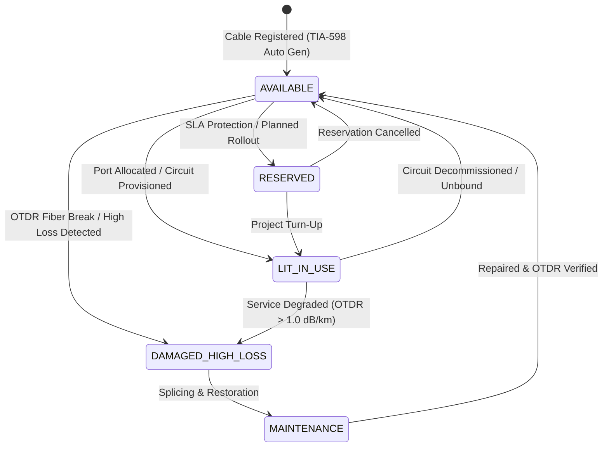

# Optical Fiber Cables & Core Matrix Infrastructure Management

## Document Control
- **Document Title**: Technical Architecture & Operating Manual: Outside Plant (OSP) & Inside Plant (ISP) Optical Fiber Infrastructure & Core Matrix
- **Classification**: Standard Operating Procedure & Architecture Reference — Netstream Telecom Inventory Suite
- **Author**: Antigravity Network Architecture Team
- **Version**: 1.0.0
- **Status**: Production Approved

---

## 1. Executive Overview

In modern telecommunication networks, fiber optic cables constitute the foundational physical transport layer for both **Active Network Equipment (ANE)** (such as DWDM optical transponders, IP/MPLS Core & PE Routers, GPON OLTs) and **Passive Network Equipment (PNE)** (such as ODFs, ODCs, Splice Closures, and ODPs).

Netstream provides a **Carrier-Grade Optical Cable & Core Strand Digital Twin** that tracks every single glass strand across outside-plant (OSP) underground duct, aerial pole, and inside-plant (ISP) riser fiber plants.

```mermaid
graph LR
    subgraph Central Office / POP Hub
        RTR["Core / PE Router<br/>or GPON OLT"]
        ODF["ODF Patch Panel<br/>(144 Ports)"]
        RTR -->|Patch Cord| ODF
    end

    subgraph Outside Plant - OSP Fiber Route
        FDR["Feeder Cable: CBL-FDR-CGK-48C<br/>(48 Cores • Tube 1-4)"]
        FOSC["Splice Closure / Manhole<br/>(FOSC-CGK-MH04)"]
        DIST["Dist Cable: CBL-DIST-SCBD-24C<br/>(24 Cores • Tube 1-2)"]
        ODC["ODC Street Cabinet<br/>(1:4 Primary Splitter)"]
        ODP["ODP Wall/Pole FAT<br/>(1:8 Secondary Splitter)"]
        DROP["Drop Cable: CBL-DROP-TLT-02C<br/>(2 Cores • G.657A2)"]

        ODF -->|48-Core Feeder| FDR
        FDR --> FOSC
        FOSC -->|24-Core Branch| DIST
        DIST --> ODC
        ODC --> ODP
        ODP -->|2-Core Drop| DROP
    end

    subgraph Customer Demarcation
        ONT["Customer ONT / CPE<br/>(ONT-TLT-FL18-01)"]
        DROP --> ONT
    end

    classDef active fill:#0284c7,stroke:#38bdf8,stroke-width:2px,color:#fff;
    classDef passive fill:#059669,stroke:#34d399,stroke-width:2px,color:#fff;
    classDef fiber fill:#0f172a,stroke:#64748b,stroke-width:1px,color:#94a3b8;

    class RTR,ONT active;
    class ODF,FOSC,ODC,ODP passive;
    class FDR,DIST,DROP fiber;
```



---

## 2. Optical Fiber Cable Classifications

Every optical cable registered in Netstream is categorized by its physical topology tier and functional purpose:

| Cable Type Code | Category Name | Typical Span Length | Core Counts | Typical Sheath & Installation | Real-World Network Role |
| :--- | :--- | :--- | :--- | :--- | :--- |
| **`BACKBONE_TRUNK`** | Long-Haul & Metro Backbone | $10\text{ km} - 1,000+\text{ km}$ | 72, 96, 144, 288 | Double Armored Steel, Underground Duct / Subsea | Inter-city DWDM optical transport, Core Router 100G/400G ring interconnections. |
| **`FEEDER_CABLE`** | Central Office Feeder Trunk | $1\text{ km} - 10\text{ km}$ | 48, 72, 96, 144 | Armored HDPE, Underground Duct | Links Central Office Optical Distribution Frame (ODF) to street Optical Distribution Cabinets (ODC). |
| **`DISTRIBUTION_CABLE`**| Distribution Fiber | $200\text{ m} - 2\text{ km}$ | 12, 24, 48 | Dielectric Duct (ADSS) or Underground | Feeds neighborhood clusters from ODC cabinets to street/pole Optical Distribution Points (ODP / FAT). |
| **`DROP_CABLE`** | Last-Mile FTTH Drop | $10\text{ m} - 200\text{ m}$ | 1, 2, 4 | LSZH Flame Retardant, Figure-8 Aerial or Indoor Riser | Final span connecting outdoor ODP terminal box to indoor Customer Demarcation (ONT/ONU/Modem). |
| **`PATCH_CORD`** | Optical Jumper | $0.5\text{ m} - 15\text{ m}$ | 1, 2 (Simplex/Duplex)| Flexible PVC/LSZH Yellow (SM) / Aqua (MM) | Inter-rack connection between active transceivers and passive ODF bulkheads. |

---

## 3. Core Strand Statuses & Operational Meanings

Each optical cable consists of $N$ individual glass strands. Netstream tracks the discrete lifecycle and transmission state of each strand:



### Detailed State Definitions

1. **`AVAILABLE` (Dark Fiber - Unlit Capacity)**:
   - **Definition**: Physical glass strand is spliced and continuity-tested, but **no optical laser or transceiver is active**.
   - **Commercial Role**: Available inventory ready to be allocated for a new customer service, sold as raw Dark Fiber lease, or kept as spare capacity.
   - **UI Representation**: Emerald badge `AVAILABLE` with measured baseline loss ($dB$).

2. **`LIT_IN_USE` (Active / Lit Fiber)**:
   - **Definition**: Active transceivers (SFP/SFP+/QSFP28/DWDM Lambda/GPON Laser) are transmitting optical data through this specific strand.
   - **Operational Rule**: **Locked against double-allocation**. Linked to a specific customer `serviceId`, customer name, and `hopOrder`.
   - **UI Representation**: Glowing Cyan badge `LIT_IN_USE` showing circuit code (e.g. `SVC-GPON-2026-0888 • Hop #2`).

3. **`RESERVED` (Planned / Protection Strand)**:
   - **Definition**: The strand is tagged for an upcoming project, customer order in progress, or as the 1+1 optical protection path.
   - **Operational Rule**: Cannot be picked by general provisioning workflows without override.

4. **`DAMAGED_HIGH_LOSS` (Faulty / High Attenuation)**:
   - **Definition**: OTDR measurement indicates excessive attenuation ($> 1.0\text{ dB/km}$), a macro-bend, fiber pinch, or physical fiber cut.
   - **Operational Rule**: Marked out-of-service to prevent provisioning until physical field repair is complete.

5. **`MAINTENANCE` (Under OTDR Loopback / Splicing)**:
   - **Definition**: Strand is temporarily disconnected for field splicing, OTDR trace testing, or rerouting.

---

## 4. TIA-598-C Optical Color Coding & Tube Architecture

Netstream strictly implements the international **TIA/EIA-598-C standard 12-color sequence** for core strands and buffer tubes:

### The 12-Color Sequence

| Position # | Color Name | Hex Code | Visual Swatch | Typical Wavelength Loss (1310/1550nm) |
| :---: | :---: | :---: | :---: | :---: |
| **1** | **Blue** | `#3b82f6` | <span style="background:#3b82f6;color:white;padding:2px 8px;border-radius:4px;">Blue</span> | $0.35 / 0.22\text{ dB/km}$ |
| **2** | **Orange** | `#f97316` | <span style="background:#f97316;color:white;padding:2px 8px;border-radius:4px;">Orange</span> | $0.35 / 0.22\text{ dB/km}$ |
| **3** | **Green** | `#22c55e` | <span style="background:#22c55e;color:white;padding:2px 8px;border-radius:4px;">Green</span> | $0.35 / 0.22\text{ dB/km}$ |
| **4** | **Brown** | `#92400e` | <span style="background:#92400e;color:white;padding:2px 8px;border-radius:4px;">Brown</span> | $0.35 / 0.22\text{ dB/km}$ |
| **5** | **Slate (Grey)** | `#64748b` | <span style="background:#64748b;color:white;padding:2px 8px;border-radius:4px;">Slate</span> | $0.35 / 0.22\text{ dB/km}$ |
| **6** | **White** | `#f8fafc` | <span style="background:#f8fafc;color:black;border:1px solid #ccc;padding:2px 8px;border-radius:4px;">White</span> | $0.35 / 0.22\text{ dB/km}$ |
| **7** | **Red** | `#ef4444` | <span style="background:#ef4444;color:white;padding:2px 8px;border-radius:4px;">Red</span> | $0.35 / 0.22\text{ dB/km}$ |
| **8** | **Black** | `#1e293b` | <span style="background:#1e293b;color:white;padding:2px 8px;border-radius:4px;">Black</span> | $0.35 / 0.22\text{ dB/km}$ |
| **9** | **Yellow** | `#eab308` | <span style="background:#eab308;color:black;padding:2px 8px;border-radius:4px;">Yellow</span> | $0.35 / 0.22\text{ dB/km}$ |
| **10** | **Violet** | `#a855f7` | <span style="background:#a855f7;color:white;padding:2px 8px;border-radius:4px;">Violet</span> | $0.35 / 0.22\text{ dB/km}$ |
| **11** | **Rose (Pink)** | `#ec4899` | <span style="background:#ec4899;color:white;padding:2px 8px;border-radius:4px;">Rose</span> | $0.35 / 0.22\text{ dB/km}$ |
| **12** | **Aqua** | `#06b6d4` | <span style="background:#06b6d4;color:black;padding:2px 8px;border-radius:4px;">Aqua</span> | $0.35 / 0.22\text{ dB/km}$ |

### Buffer Tube Calculation Formula

Cables with more than 12 cores group strands into **12-Core Buffer Tubes**:
$$\text{Tube Number} = \left\lfloor \frac{\text{Core Number} - 1}{12} \right\rfloor + 1$$
$$\text{Color Index} = (\text{Core Number} - 1) \bmod 12$$

- **Example 1**: Core #12 $\implies$ Tube 1, Color Index 11 (**Aqua**).
- **Example 2**: Core #13 $\implies$ Tube 2, Color Index 0 (**Blue**).
- **Example 3**: Core #48 $\implies$ Tube 4, Color Index 11 (**Aqua**).

---

## 5. Database Schema Reference

The optical fiber infrastructure is persisted under the `inventory` PostgreSQL schema:

### `inventory.inv_optical_cables` Table
```sql
CREATE TABLE inventory.inv_optical_cables (
    id UUID PRIMARY KEY DEFAULT gen_random_uuid(),
    cable_code VARCHAR(64) NOT NULL UNIQUE,
    cable_name VARCHAR(255) NOT NULL,
    cable_type VARCHAR(32) NOT NULL,            -- BACKBONE_TRUNK, FEEDER_CABLE, etc.
    fiber_grade VARCHAR(32) NOT NULL,           -- SINGLE_MODE_G652D, SINGLE_MODE_G657A2, etc.
    total_cores INT NOT NULL DEFAULT 24,
    lit_cores INT NOT NULL DEFAULT 0,
    dark_cores INT NOT NULL DEFAULT 24,
    length_meters NUMERIC(10,2) NOT NULL DEFAULT 1000.0,
    origin_location_id UUID REFERENCES inventory.inv_locations(id),
    origin_device_id UUID REFERENCES inventory.inv_devices(id),
    termination_location_id UUID REFERENCES inventory.inv_locations(id),
    termination_device_id UUID REFERENCES inventory.inv_devices(id),
    installation_type VARCHAR(32) DEFAULT 'UNDERGROUND_DUCT',
    sheath_type VARCHAR(32) DEFAULT 'ARMORED_HDPE',
    attenuation_db_per_km NUMERIC(5,3) DEFAULT 0.350,
    status VARCHAR(32) NOT NULL DEFAULT 'ACTIVE',
    created_at TIMESTAMP WITH TIME ZONE DEFAULT NOW(),
    updated_at TIMESTAMP WITH TIME ZONE DEFAULT NOW()
);
```

### `inventory.inv_cable_strands` Table
```sql
CREATE TABLE inventory.inv_cable_strands (
    id UUID PRIMARY KEY DEFAULT gen_random_uuid(),
    cable_id UUID NOT NULL REFERENCES inventory.inv_optical_cables(id) ON DELETE CASCADE,
    core_number INT NOT NULL,
    tube_number INT NOT NULL,
    color_name VARCHAR(32) NOT NULL,
    color_hex VARCHAR(16) NOT NULL,
    status VARCHAR(32) NOT NULL DEFAULT 'AVAILABLE',  -- AVAILABLE, LIT_IN_USE, RESERVED, etc.
    allocated_service_id UUID REFERENCES inventory.inv_services(id) ON DELETE SET NULL,
    allocated_service_hop INT,
    measured_loss_db NUMERIC(5,2),
    remarks VARCHAR(255),
    created_at TIMESTAMP WITH TIME ZONE DEFAULT NOW(),
    updated_at TIMESTAMP WITH TIME ZONE DEFAULT NOW(),
    CONSTRAINT uq_cable_core UNIQUE(cable_id, core_number)
);
```

---

## 6. REST API Endpoints Reference

All endpoints are authenticated and exposed under `/api/v1/inventory/cables`:

| Method | Endpoint | Description | Request Body / Parameters |
| :--- | :--- | :--- | :--- |
| `GET` | `/api/v1/inventory/cables` | List all registered optical cables with core utilization counts. | None |
| `GET` | `/api/v1/inventory/cables/{id}` | Get full cable details and all strand matrices ($1..N$). | Path parameter: `id` |
| `POST` | `/api/v1/inventory/cables` | Register a new optical cable. Automatically instantiates all strands. | JSON: `CreateCableRequest` |
| `PUT` | `/api/v1/inventory/cables/strands/{strandId}` | Update individual strand status (`AVAILABLE` $\leftrightarrow$ `LIT_IN_USE`). | JSON: `UpdateStrandRequest` |
| `DELETE` | `/api/v1/inventory/cables/{id}` | Delete an optical cable and its strands. | Path parameter: `id` |

### Sample POST Request Payload
```json
{
  "cableCode": "CBL-FDR-CGK-48C",
  "cableName": "Central POP Feeder Trunk to SCBD Area",
  "cableType": "FEEDER_CABLE",
  "fiberGrade": "SINGLE_MODE_G652D",
  "totalCores": 48,
  "lengthMeters": 1800.0,
  "originLocationId": "a0eebc99-9c0b-4ef8-bb6d-6bb9bd380a11",
  "originDeviceId": "c0eebc99-9c0b-4ef8-bb6d-6bb9bd380a20",
  "terminationLocationId": "a0eebc99-9c0b-4ef8-bb6d-6bb9bd380a11",
  "terminationDeviceId": "c0eebc99-9c0b-4ef8-bb6d-6bb9bd380a22",
  "installationType": "UNDERGROUND_DUCT",
  "sheathType": "ARMORED_HDPE",
  "attenuationDbPerKm": 0.350
}
```

---

## 7. Operating Workflows (Step-by-Step)

### 7.1 Registering a New Optical Cable
1. In the sidebar or top tab, navigate to **Inventory Module &rarr; Optical Cables & Cores**.
2. Click the top-right button **`+ Register Optical Cable`**.
3. Select a **Total Optical Core Count** preset ($12C, 24C, 48C, 72C, 96C, 144C, 288C$).
4. Enter the **Origin Point (A-End)** site and equipment (e.g. `ODF-CGK-R01-01`) and the **Termination Point (Z-End)** (e.g. `ODC-CGK-CBD-01`).
5. Set length in meters and installation type.
6. Click **`Register Optical Cable`**. The backend will automatically generate the $N$-core TIA-598 color strand matrix.

### 7.2 Inspecting the 12..288 Core Tray Matrix
1. In the Optical Cables table, find the desired cable row.
2. Click **`Inspect Cores (Matrix)`**.
3. The visual modal displays all buffer tubes (Tube 1, Tube 2, etc.) and individual color-coded strand chips.
4. Click on any strand chip (e.g. `Core #12 Aqua`) on the left to view its **Active Customer Circuit**, **Hop Order**, **Optical Attenuation ($dB$)**, and **Operational Status**.
5. Operators can quickly release a core back to **Dark Fiber** or toggle maintenance.

### 7.3 Allocating Cores in Service Paths
1. When configuring a customer service path or port allocation in **Physical Hardware**:
2. Open the **`Allocate Port`** modal.
3. Under the optional **"Bind Optical Fiber Cable & Core Strand"** section, select the optical cable span and an available Dark Fiber strand.
4. When saved, the strand status automatically transitions to **`LIT_IN_USE`** and is bound to the circuit.

---

## 8. Real-World Live Data Reference

The table below lists the active seed cables configured in the Netstream production database:

| Cable Code | Type | Cores | Lit / Dark | Route Distance | A-End Equipment | Z-End Equipment | Active Service Allocation |
| :--- | :--- | :---: | :---: | :---: | :--- | :--- | :--- |
| **`CBL-FDR-CGK-48C`** | Feeder | 48 | 1 / 47 | $1.8\text{ km}$ | `ODF-CGK-R01-01` | `FOSC-CGK-MH04` | `SVC-GPON-2026-0888` (Core #12 Aqua) |
| **`CBL-DIST-SCBD-24C`**| Distribution | 24 | 1 / 23 | $0.6\text{ km}$ | `ODC-CGK-CBD-01` | `ODP-CGK-TLT-01` | `SVC-GPON-2026-0888` (Core #3 Green) |
| **`CBL-DROP-TLT-02C`** | Drop | 2 | 1 / 1 | $65\text{ m}$ | `ODP-CGK-TLT-01` | `ONT-TLT-FL18-01` | `SVC-GPON-2026-0888` (Core #1 Blue) |
| **`CBL-TRK-01`** | Backbone | 96 | 2 / 94 | $789\text{ km}$ | `ID-CGK-DWDM-OPT-01` | `ID-SUB-METRO-AGG-01` | `SVC-MPLS-2026-0091` (Core #1 Blue), `SVC-ME-2026-0250` (Core #2 Orange) |
| **`CBL-METRO-CGK-72C`**| Backbone | 72 | 1 / 71 | $12\text{ km}$ | `ID-CGK-METRO-AGG-01` | `ID-CGK-PE-RTR-01` | `SVC-ME-2026-0250` (Core #1 Blue) |
