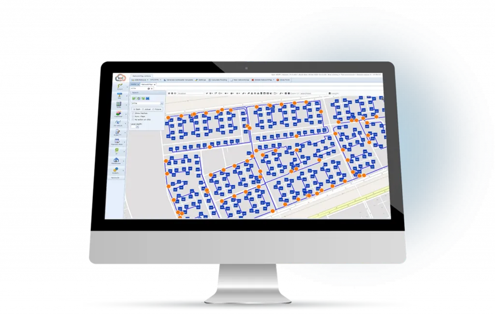
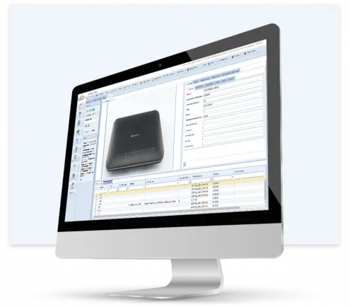
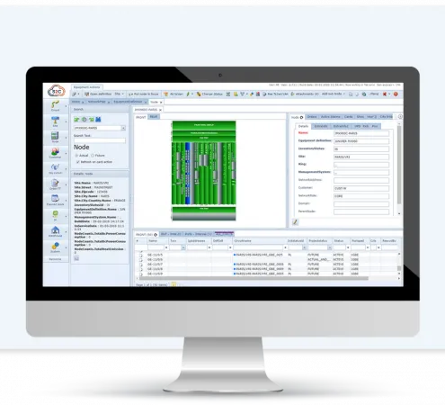
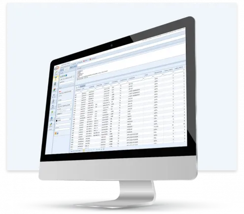
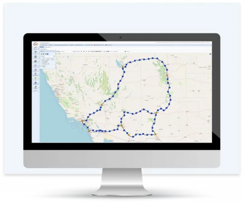
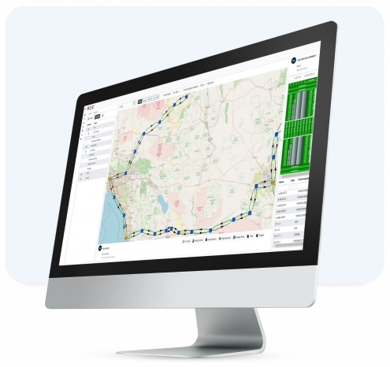
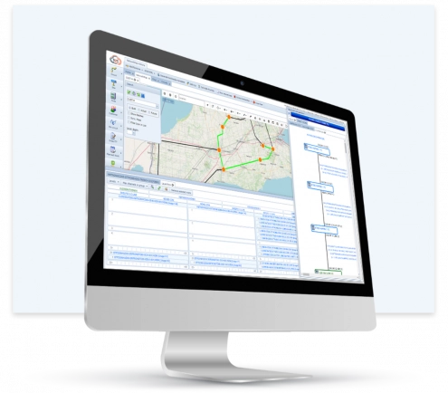
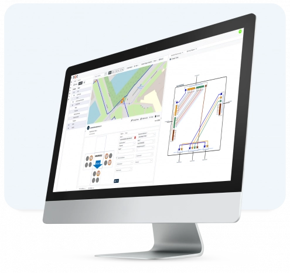

# 1. Inventory Module

The inventory module of VC4 S2C captures all assets – physical, logical, virtual, and service and then maps these to the physical network, delivering a rich, interactive view.
## 1.1. Physical inventory

The inventory management module contains all physical resources used to build your network and connectivity paths. All assets are recorded, creating a complete record of components – including sites, floorplans, racks, active/passive equipment, connections – in a single view.

- Circuits, connections, and cables, including outside plant (GIS)
- Floor plans, racks, DDF/ODF, power and more
- Network devices, infrastructure, and assets

## 1.2. Logical & virtual inventory
The logical layer contains active devices and technologies, while the virtual layer includes virtual network elements (VNE) and VNFs. This module helps you track network resources, network configuration, and service connections in one place.

- Virtual and physical devices and network inventory
- Network configuration and connections
- IP addresses, VLANs, VRFs, subnets, and routing information
- Network slicing, shared services, and virtual links

## 1.3. Service inventory

The service inventory module contains all services running in your network. It provides a complete picture of all layers from the physical layer up to the service layer, giving end-to-end visibility of all services.

- Service lifecycle management (create, provision, modify, delete)
- Service-to-resource mapping (physical and virtual)
- Service inventory by business group, service type, and technology

## 1.4. Planning
Planning module delivers faster service provisioning and network rollout with robust planning and lifecycle management. It streamlines workflows from site survey and capacity checks to documentation and approvals.

- Streamlined service provisioning workflow
- Automated bandwidth planning and service bounding
- Site survey integration and cost calculation
- Service-level agreement (SLA) and change-management approvals

## 1.5. Network planning, change and capacity management
The Capacity Management (CM) module provides visibility into network capacity across all layers. By analyzing service and network inventory data, the CM module can predict network congestion and identify optimization needs, ensuring network stability.

## 1.6. Understand network costs

The telecom network inventory management module includes automated cost analysis functions, backed by rules. This allows operators to use criteria, such as the shortest path, fewest hops, or lowest cost to understand network costs from different perspectives.

- Optimize designs to meet financial goals
- Create rules aligned with your business
- Enable automated workflow management

## 1.7. Network location management

Understand and manage all network locations, with clear geographic information about each site and its hierarchy – from countries to cities and buildings, all the way to the floor plans. It takes telecom network inventory management to the next level.

- A complete digital twin of your network
- Cabinets, racks, DDF/ODF and more
- Customize to your needs

# 2. GIS Module

Integrated GIS mapping for telecoms, The GIS telecom module offers complete integration of your logical and physical inventory with GIS mapping capabilities and geographic backgrounds.

## 2.1. Visualize and explore your network – graphically or geographically
With GIS-enabled telecoms inventory management, you can easily view the location of all your network assets. The GIS module is fully interactive, allowing you to zoom in on different locations, all the way down to trench, duct, fiber cable, manhole/handhole and enclosure level.

## 2.2. Open and Standardized

The GIS telecom information is based on our own geo-database, while you can select whichever background maps you prefer (such as Google, Bing, OpenStreet Maps, ESRI, or specific government agencies), and is fully aligned with your network inventory.

- Visualize physical (active and passive), logical, virtual assets, workflows and more
- Plot and control all connectivity types, color coded for convenience
- Create complete Bill of Materials for current and planned connections

## 2.3. Understand Capacity and Plan More Effectively

With the GIS telecom module, users can select any type of connectivity to understand routes, current capacity, and the impact of changes. Plan new connections, with the optimum path automatically selected to manage costs and accelerate service deployment.

- Create sites, expand views, and measure distances
- Draw new connection paths and align with geo data
- Manage network changes from a single interface

## 2.4 Interactive and Dynamic Network Maps

- Automatic connectivity visualization: Draw connections, services, and equipment based on real-time database information.
- Interactive maps with clickable objects: Open detailed records of equipment, manholes, splice boxes, and other network elements directly from the map.
- Right-click menus provide quick access to object- specific actions and detailed insights.

# 3. Leased Line Module
A leased line in telecommunications is a dedicated, fixed-bandwidth data connection connecting two locations. It is called a "leased" line because a business or organization pays a monthly rental fee to a telecom service provider (like AT&T, Verizon, or BT) for exclusive rights to that specific circuit.

Unlike standard broadband connections that are shared among multiple customers (which can cause speeds to drop during peak hours), a leased line is entirely private and reserved solely for the organization leasing it.

## Key Characteristics

- Dedicated Bandwidth: The connection is not shared with anyone else, ensuring you always get the exact speed you pay for, regardless of the time of day.
- Symmetric Speeds: Upload and download speeds are identical (e.g., 1 Gbps up and 1 Gbps down), which is crucial for businesses running large servers, VoIP phone systems, or heavy cloud backups.
- Service Level Agreements (SLAs): Telecom providers attach strict guarantees to leased lines, promising high uptime (often 99.99%) and rapid repair times (e.g., fixing faults within 4 hours).
- Privacy and Security: Because the line is physically or logically separated from public traffic, it offers a highly secure way to transmit sensitive data.

## Examples of Leased Lines in Action

1. Point-to-Point (Site-to-Site) Connection
A hospital system needs to regularly transfer massive, highly sensitive MRI and CT scan files between its main imaging center and a remote surgical wing. To guarantee the files transfer instantly and securely without touching the public internet, the hospital rents a point-to-point leased line connecting the two buildings.

2. Dedicated Internet Access (DIA)
A software development company with 300 employees relies heavily on cloud computing, video conferencing, and pushing large code repositories. A standard business internet connection would struggle under the load. Instead, the company provisions an Internet Leased Line from their local telecom provider directly to their office router, guaranteeing a consistent, unshared 10 Gbps connection to the internet at all times.

3. Financial Trading Floor to Data Center
High-frequency trading firms require absolute minimum latency (delay) to execute trades faster than competitors. A trading firm in Chicago might lease a specialized, ultra-low-latency fiber optic line directly to a stock exchange's data center in New Jersey, ensuring their trading algorithms have a dedicated, uninterrupted path.

Bringing together all leased connections, including leased capacity from other operators. This is backed by financial reporting and analysis.

- Complete view of leased line connections
- Related leased line and your own network inventory objects
- A consolidated commercial information register 
- Eliminate redundant leased lines
- Automated invoice checks

## 3.1. A single, comprehensive view of all your leased lines

The leased lines you rent from other operators enable you to extend capacity and build new connections. However, costs can rapidly grow, which creates operational challenges. The Leased Line module provides an automated management solution that delivers a unified, comprehensive view of all your leased lines plus dark fiber and their costs.

## 3.2. Understand all relationships and commitments

The Leased Line module shows all your leased lines and their relationships to other assets. It allows you to view the provider and to align with your routes. With contract and invoice information, you can check commitments and SLAs.

- A complete record of all leased lines and their providers
- Clear relationship between leased lines and other network inventory objects
- Contracts, financial details, invoices, and SLAs

## 3.3. Eliminate over-capacity and plan efficiently

Unused leased lines are a huge problem in leased line management. The Leased Line module enables you to check which lines are used and which are not, allowing you to audit and control expenditure. When changes are necessary, easily see which are affected.

- Align leased line inventory with financial tools
- Track and manage capacity to avoid waste
- Reduce and optimize costs

# 4. IP Management Module
Manage and discover all IP addresses (IPv4 /IPv6) for registration and assignment.

- IP ranges
- Reservations
- IP automatic subnet calculation
- Auto discovery of IP addresses from live networks

## 4.1. IP address management in telecoms
The IP Management module enables efficient creation and management of IP address ranges and addresses, supporting both IPv4 and IPv6, resolving conflicts and ensuring effective allocation.

## 4.2. Manage all ranges, sub-ranges, individual IP addresses and domains
IP addresses are essential for the identification of resources in a telecoms network. With an expanding footprint of solutions, terminals and devices, effective IP address management (IPAM) at every level has become critical. The IP Management Module simplifies this, backed by automated processes and accurate mapping between equipment and addresses.

## 4.3. Automatically maintain accurate IP address data
The IP Management module enables network administrators to automate the task of maintaining an accurate, up-to-date record of all IP addresses in the network and the equipment to which they are assigned.

- Easily create IP ranges, sub ranges and sub-sub ranges
- Identify in-use and unassigned IP addresses and eliminate conflicts
- Manage addresses for equipment, ports, cards, connections, and more

## 4.4. Bulk upload and import, with complete control

Import new IP addresses in bulk through the GUI or via the Bulkloader by uploading a spreadsheet, covering multiple layers and the complete address hierarchy – subnets, subnets within subnets, and more.

- Create IP address ranges and sub-ranges, for all domains
- Assign IP addresses to equipment, ports and connections/services
- Filter and view all allocations, and modify at any level – ranges, IPs, subnets and more

# 5. Telephone Number Module
Manage all geo and non-geo numbers, in alignment with inventory objects.

- Supports all countries telephone numbering systems
- Supports telephone numbering porting
- Clear reporting functionality and configuration for local authorities
- Auto discovery telephone numbers from live networks

## 5.1 Manage and track telephone number ranges, generate reports, and more
Telephone numbers continue to have a key role to play in identity and account management, for both fixed and mobile networks. The Telephone Number module provides a complete solution for effectively tracking and managing number resources, and for generating reports and discovering insights into network and user activities.

## 5.2. For any number format, including geo- and non-geographic numbers

The Telephone Number module supports any number format – E.164, geo- and non-geographic, as well as mobile MSIDNs. It correlates numbers to assets, such as circuits, customers, nodes, locations and more – providing an accurate record.

- Manage ranges and individual numbers
- Allocate and associate numbers with activation or usage
- Freephone, premium, private with any country format and plan

## 5.3. Auto-discover numbers from the live network

VC4 S2C integrates with live networks, discovering and synchronizing numbers with those managed in the Telephone Number module, ensuring accuracy – and assisting network planning. Create and manage ranges, sub-ranges, and more with granular control.

- Support business and sales processes
- Manage blocks, ranges, sub-ranges, sub-sub-ranges, and more
- Filter, search and discover

# 6. Integration Module
A unified set of processes to ensure that data is updated, with integration to all associated systems from the OSS and BSS.

- Integration with multi-vendor elements
- NMS / EMS interfaces for network auto discovery and reconciliation
- BSS / OSS RESTful APIs
- Activation and change / status tracking
- Performance management interfaces

## 6.1.Connect business processes to enhance operations

Ensuring that business processes access to all relevant data is essential for service delivery and continuous performance enhancement. The Integration module eliminates silos, brings scattered data together, and connects any process, in real-time – driving automation and seamless service management.

## 6.2. NMS / EMS / NE interfaces and automatic data reconciliation

The Integration module supports interfaces to NMS / EMS systems, as well as to Network Equipment (NE), to automatically collect and reconcile inventory data, providing a single, comprehensive record, aggregated from all sources and feeds.

- Reconciliation via Restful APIs, TMF CORBA, TMF MTOSI, TL1, XML, SNMP, CLI interfaces, and more
- Interfaces with any network and equipment vendor solution
- Scheduled reconciliation for up-to-date inventory management

## 6.3. Northbound Rest APIs for BSS/OSS integration

The Integration module enables compatibility with any other system in your organization. Our REST APIs allow integration with any OSS and BSS application, for efficient workflows and automation.

- Integration with alarm management, CRM, financial, and other systems
- Automate service fulfilment / auto provisioning, delivery, and fault-handling
- Eliminate data silos and duplication

## 6.4. Track changes and status updates, and link to alarms

The Integration module tracks changes and status updates across the network, while providing interfaces for alarm and event feeds. It supports real-time monitoring, with configurable alarms and event management - with filters and intelligent correlation. Alarms and events can be enriched with data from the network inventory, for more accurate fault isolation and management.

- Track changes in the inventory and network status
- Support for alarm/event feeds from network systems and devices
- Filters, and alarm/event management and correlation
- Enriched alarms/events with network data for faster resolution

# 7. Reporting & Dashboard Module
A complete toolkit to create scheduled and custom reports, based on clear, interactive visualization, and with automated scheduling options.

- Reports
- Dashboards
- Custom reports and templates
- Schedule and distribute

## 7.1 A single view and workspace for your team

The reporting & dashboard module provides rich reporting functionality, as well as an intuitive dashboard for organizing your activities. It delivers key OSS insights and analytics to enhance performance, putting rich business intelligence in your hands, so you can share it with your team.

## 7.2. Create custom reports for your business

Your team can see at-a-glance the status of all inventory resources, across physical, logical, virtual, and service domains. Use report templates or customize to suit your needs. Authorized users can create and adapt processes, define and allocate tasks, and more.

- Design, build and modify reports to suit your requirements
- Select the fields and data input sources you need for your network
- Control access and visibility rights for user and group admission

## 7.3.Capture rich insights and boost planning

Insights are essential to drive continuous performance enhancement. The reporting & dashboard module gives you the information and data you need to drive operational efficiency and to enhance your network investments and planning activities.

- Review status and compare historical activity to track performance
- Flexible, graphical displays for KPIs and rich visualization
- Create, schedule, and auto-distribute reports to custom recipient lists

# 8. Impact Analysis Module
Detect, track and inform customers or network operations on the impact of planned and unplanned outages.

- Planned work
- Fault impact analysis
- Single Points of Failure
- Inform customers in a consistent way

## 8.1 Keep your customers updated to ensure optimum experiences

Understanding the impact of any outages and changes is crucial for assuring consistent customer experience. With the impact analysis module, you can understand which services and customers will be affected by any planned or unplanned change and issue, so you can inform and update them.

- Detect, track and inform customers or network operations on the impact of planned and unplanned outages
- Use impact analysis to detect and understand the impact of faults and network changes
- Detect single points of failure and mitigate risk

## 8.2. Efficiently manage unplanned incidents and outages

When unexpected incidents occur, you need to be able to understand who’s affected, which network elements are impacted and to be able to pinpoint your response. The impact analysis module gives you all the information you need to make instant decisions.
- Flexible outage process creation and optimization
- Automated SLA and lead time management
- Track and compare outages with KPIs and actual performance

